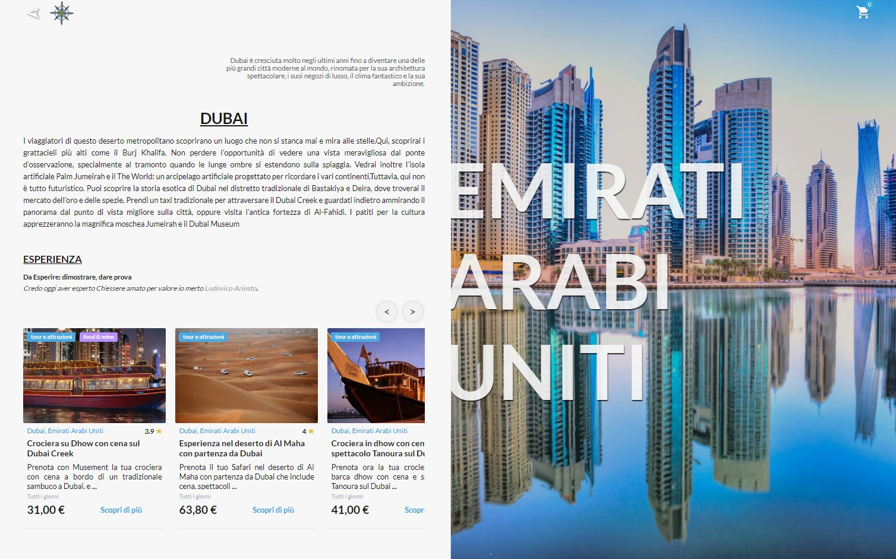

  

<h2 align="center">One project, five people, one team</h2>

  

<h2 align="center">Listen carefully, Edgemony has a tale to tell...</h2>

<h2>Technologies used</h2>
  <ul>
    <li>HTML</li>
    <li>SASS</li>
    <li>Javascript</li>
    <li>React.js</li>
      <ul>
        <li>
          useState
        </li>
        <li>
          useEffect
        </li>
        <li>
          useContext
        </li>
        <li>
          useReducer
        </li>
        <li>
          useRef
        </li>
      </ul>
    <li>Next.js</li>
      <ul>
        <li>
          Routing
        </li>
        <li>
          Server Side Rendering
        </li>
      </ul>
    <li>Axiox</li>
    <li>Musement API</li>
    <li>Made with ❤️</li>
  </ul>

  

<h2>Features</h2>
<ol>
  <li>Designed from zero</li>
  <li>Mobile First Design</li>
  <li>SEO optimized</li>
  <li>UI and UX user friendly</li>
  <li>Performance oriented</li>
  <li>Scalable and best pratices</li>
  <li>Stunning pages! 🤩</li>
</ol>

 
<h2>Performance</h2>
  

<h3>Presentation day</h3>
<h4>April 30 2021</h4>
<a href="https://explorience.vercel.app">Follow this link to visit it!</a>

<h3>Made by</h3>
<ul>
  <li>
    <a href="https://github.com/MartinaPalma">
      Martina Palma
    </a>
  </li>
  <li>
    <a href="https://github.com/Vithoosha">
      Vithoosha Sripaskaran
    </a>
  </li>
  <li>
    <a href="https://github.com/casiimir">
      Casimiro P. Ciancimino
    </a>
  </li>
  <li>
    <a href="https://github.com/simonettaviola">
      Simonetta Viola
    </a>
  </li>
  <li>
    <a href="https://github.com/sebianodiluca">
      Sebiano di Luca
    </a>
  </li>
</ul>

<h4>With the special participation of
  <a href="https://github.com/ilPhil"> 
    Stefano Russo
  </a>
</h4>
